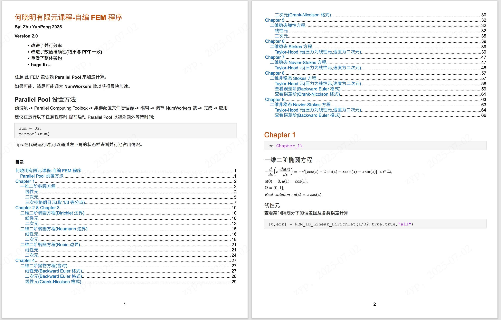
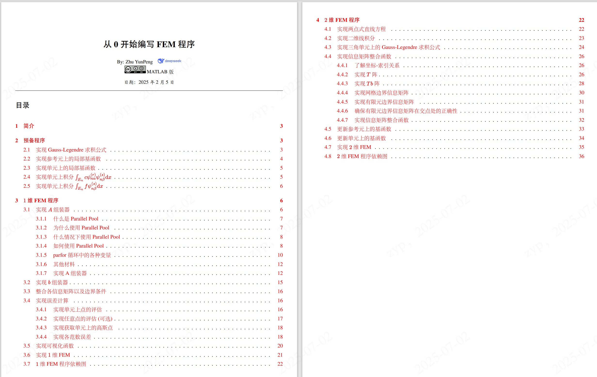

# 何晓明有限元课程-自编 FEM 程序

## 简介

本项目在学习何晓明有限元课程的基础上，编写了一套简易的MATLAB程序包。
详细使用文档请参考`FEM\README.mlx`以及`从0开始编写FEM程序.pdf`,
此外前四章的课程作业已作为示例给出`example.pdf`.

程序包及各类文档**仅供参考，不保证结果的准确性**。

## 代码结构

以下为`FEM\README.mlx`简介：

以下为`从0开始编写FEM程序.pdf`目录：

